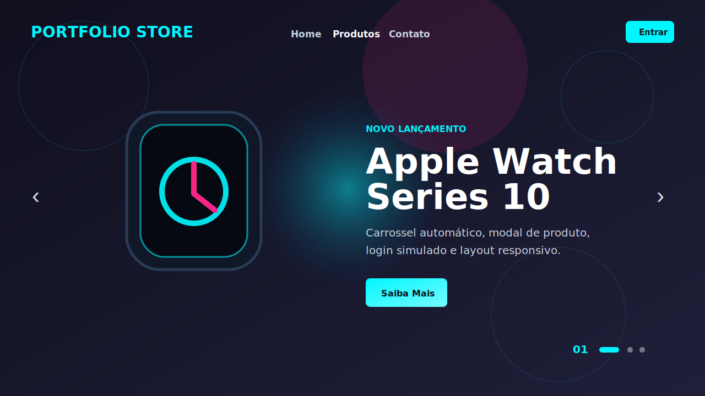

# Portfolio Store

Vitrine interativa de produtos tech feita com HTML, CSS e JavaScript puro.

## Preview

- Projeto online: [portfolio-store](https://ruanrychard.github.io/portfolio-store/)
- Repositório: [RuanRychard/portfolio-store](https://github.com/RuanRychard/portfolio-store)

## Funcionalidades

- Carrossel automático de produtos
- Navegação por setas, dots e teclado
- Modal com detalhes de cada produto
- Modal de login e cadastro
- Validação de formulário
- Medidor de força de senha
- Simulação de autenticação com persistência local
- Favoritos por usuário usando armazenamento local
- Hash de senha para evitar armazenamento em texto puro na simulação
- Seções com navegação por âncoras
- SEO básico, Open Graph e favicon SVG
- Layout responsivo

## Tecnologias

- HTML5
- CSS3
- JavaScript
- GitHub Pages

## Observação

O login é uma simulação front-end para fins de estudo e portfólio. Ele não deve ser usado como autenticação real em produção.

## Próximas melhorias

- Refinar acessibilidade do modal
- Adicionar listagem visual dos favoritos do usuário
- Melhorar a documentação com screenshot real do projeto publicado
